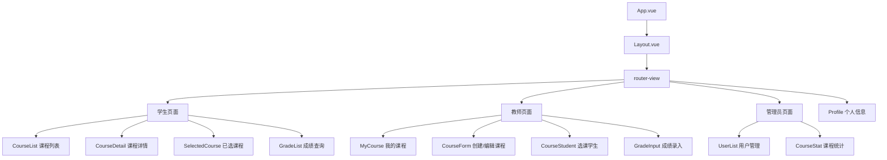

# Alaya 大学选课系统 — 前端

基于 Vue 3 的大学选课系统前端 SPA，为学生、教师、管理员提供选课、课程管理、成绩管理与数据统计的交互界面。

---

## 技术栈

| 技术 | 版本/说明 |
|------|----------|
| Vue | 3 |
| Vite | 7 |
| UI 框架 | Element Plus |
| 状态管理 | Pinia |
| 路由 | Vue Router |
| HTTP 客户端 | Axios |
| 表单校验 | vee-validate |
| 端口 | 5173 |

---

## 功能模块

- **登录**：Session 认证，登录后按角色跳转对应首页
- **学生端**：课程浏览（分页+搜索+学期筛选）、选课/退课、已选课程、成绩查询（学期筛选+等级中文显示）
- **教师端**：我的课程 CRUD、选课学生名单（分页+关键词搜索）、成绩录入（单条/批量，自动计算 A-F 等级）
- **管理员端**：用户管理（CRUD+分页+角色筛选+重置密码）、课程统计（选课率进度条+学期筛选）
- **路由守卫**：未登录 → 登录页，角色不匹配 → 403 页
- **通用**：个人信息修改

---

## 系统架构



---

## 项目结构

```
src/
├── api/               # Axios 请求封装
│   ├── request.js     # Axios 实例（baseURL、拦截器、统一错误处理）
│   ├── auth.js        # 登录/登出/获取用户信息
│   ├── course.js      # 课程 API
│   ├── selection.js   # 选课/退课 API
│   ├── grade.js       # 成绩 API
│   ├── stat.js        # 管理员统计 API
│   ├── export.js      # 导出 API
│   └── user.js        # 用户 API
├── store/
│   └── user.js        # Pinia 用户状态（userInfo, isLogin, login/logout/initUserInfo）
├── router/
│   └── index.js       # 路由定义 + 导航守卫（角色权限校验）
├── views/
│   ├── login/Login.vue    # 登录页
│   ├── Layout.vue         # 主布局（侧边栏+顶栏+内容区）
│   ├── 403.vue            # 无权限页
│   ├── profile/Profile.vue # 个人信息
│   ├── student/           # 学生端页面
│   ├── teacher/           # 教师端页面
│   └── admin/             # 管理员端页面
├── App.vue
└── main.js
```

---

## 环境要求

- Node.js 18+

---

## 快速启动

### 1. 安装依赖

```bash
npm install
```

### 2. 配置后端地址

编辑 `.env.development`：

```env
VITE_API_BASE_URL = "http://localhost:8080/api"
VITE_APP_TITLE = "Alaya 大学选课系统"
```

### 3. 启动开发服务器

```bash
npm run dev
```

访问 `http://localhost:5173`。

---

## 构建部署

### 生产构建

```bash
npm run build
```

生成静态文件到 `dist/` 目录。

### Nginx 静态部署

```nginx
server {
    listen 80;
    server_name alaya.example.com;

    root /opt/alaya/dist;
    index index.html;

    # Vue Router history 模式
    location / {
        try_files $uri $uri/ /index.html;
    }

    # API 反向代理
    location /api/ {
        proxy_pass http://127.0.0.1:8080/api/;
        proxy_set_header Host $host;
        proxy_set_header X-Forwarded-For $proxy_add_x_forwarded_for;
    }
}
```

---

## 部署指南

1. 执行 `npm run build`，将 `dist/` 上传至服务器
2. 使用 Nginx 托管静态文件（配置见上节）
3. 确保后端服务已启动，Nginx 正确反向代理 API 请求
4. 生产环境建议将 `VITE_API_BASE_URL` 改为生产域名或通过 Nginx 同源代理（避免跨域）

---

## 开发约定

- **API 请求**：`request.js` 的 `baseURL` 来自 `VITE_API_BASE_URL` = `http://localhost:8080/api`。所有前端 API 调用**不要再加 `/api` 前缀**，否则双重前缀 → 404
- **响应拦截**：Axios 拦截器校验 `res.code === 200`，返回 `response.data`（即整个响应体）
- **路由守卫**：`router/index.js` 从 `userStore.userInfo.role` 读取角色（`STUDENT` / `TEACHER` / `ADMIN`），校验路由 `meta.role`
- **`ElMessageBox.confirm` 正确用法**：

  ```js
  // ✅ 正确 — Promise 模式
  ElMessageBox.confirm(msg, title, { type: 'warning' })
    .then(async () => { /* 确认逻辑 */ })
    .catch(() => { /* 取消 */ })

  // ❌ 错误 — 回调模式不会被调用
  ElMessageBox.confirm({ title, message, type, async confirm() {} })
  ```

- **角色枚举值**：前端 el-option 的 value 和比对逻辑必须用大写 `"STUDENT"` / `"TEACHER"` / `"ADMIN"`，与后端枚举 `name()` 对齐

---

## 常见问题

### 登录后页面 403

后端重启后 Session 全部失效，需清除浏览器 Cookie 后重新登录。也可能是用户角色与当前路由不匹配，检查 `meta.role`。

### API 请求 404

检查是否在 API 调用中重复添加了 `/api` 前缀。`request.js` 的 `baseURL` 已包含 `/api`，例如调用 `course.js` 的 `getCourseList` 应传路径 `/student/courses`，而非 `/api/student/courses`。

### 弹窗确认后无反应

检查是否使用了 `ElMessageBox.confirm` 的错误回调模式。正确用法为 Promise 链式调用（见开发约定）。

### 路由守卫无限重定向

`userStore.initUserInfo()` 获取用户信息后未正确设置 `userInfo`，导致 `isLogin` 为 `false` 循环跳转登录页。检查后端 `/api/auth/user/info` 是否正常返回。

### 下拉选择角色后保存报 400

角色值需为大写（`STUDENT` / `TEACHER` / `ADMIN`），小写值后端 Jackson 反序列化枚举会失败。

---

## 维护者

- **fengyuan404** — YouFull@163.com